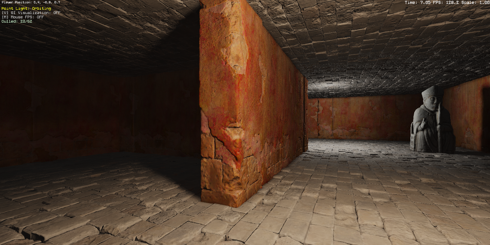
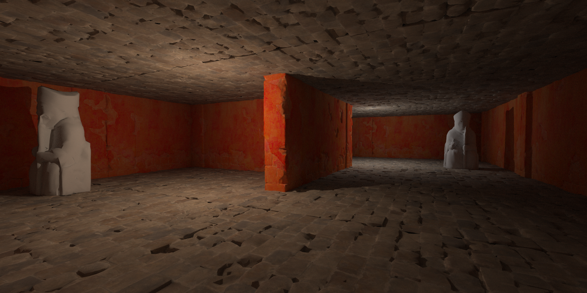
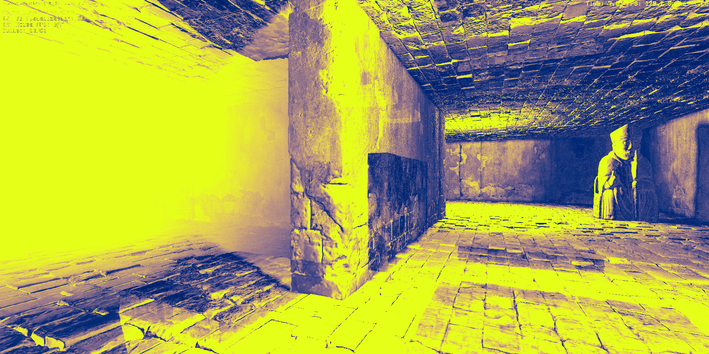

# LuminaGI-CudaRef

CUDA path tracer used as a reference for [LuminaGI](https://github.com/CarlottaSeal),
a DX12 GI engine with screen probes, voxel lighting, and a surface card cache.
LuminaGI's GI is approximate; this renderer is brute-force so its output gives
you something to diff against — PSNR/SSIM numbers and a per-pixel heatmap
that show where the approximation drifts.

| LuminaGI (engine) | CUDA reference (this repo) | Abs-diff heatmap |
|---|---|---|
|  |  |  |

*Test scene: 62 meshes, 1.12M triangles, 3 lights (1 sun + 2 point).*

## Pipeline

```
LuminaGI (DX12)           │   LuminaGI-CudaRef (this repo)
──────────────────────────┼────────────────────────────────────────
F9 ─┬─► screenshot.png    │
    └─► scene.json ───────┼──► LoadScene  ─► Build LBVH (150 ms)
                          │                      │
                          │                      ▼
                          │                  CUDA kernel (4 ms)
                          │                      │
                          │                      ▼
                          │                  reference.png
                          │                      │
        screenshot.png ───┼──► tools/diff.py ◄───┘
                          │          │
                          │          ▼
                          │     HTML report (PSNR / SSIM / heatmap)
```

`Scene::DumpToJSON()` on the engine side writes triangle soup + lights +
camera in world space. `validate.py` runs the render + diff end-to-end.

## Numbers

Hardware: RTX 4080 Laptop, Ada Lovelace SM 8.9 (58 SMs, 12 GB, ~40 MB L2).

Timings (test scene):

| Stage | Time |
|---|--:|
| JSON load (1.1M tris, ~300 MB) | 12 s (host) |
| LBVH build (Morton + radix split) | 150 ms (CPU) |
| Render kernel, direct only, 1 spp | **4 ms** |
| Render kernel, 64 spp / 2 bounces | **3.0 s** |
| Render kernel, 256 spp / 2 bounces | **8.7 s** |
| Image diff (PSNR / SSIM / heatmap) | 1.5 s |

Reference vs engine (64 spp, 2 bounces):

| Metric | Value |
|---|--:|
| PSNR | **21.8 dB** |
| SSIM | **0.631** |
| Mean abs diff | 13.4 / 255 |

Nsight Compute on `accumulate_kernel`
(full analysis in [`docs/profile_analysis.md`](docs/profile_analysis.md),
raw report `docs/accumulate.ncu-rep`):

| Metric | Value |
|---|--:|
| L2 Cache Throughput | **90.8%** |
| DRAM Throughput | 7.2% |
| L1 / L2 Hit Rate | 78.3% / 97.8% |
| Compute (SM) Throughput | 61.4% |
| Theoretical / Achieved occupancy | 66.7% / 61.8% (after reg fix) |
| Branch Efficiency | 83.6% |

Kernel is **L2-bandwidth bound**, not compute-bound. Working set lives in L2;
DRAM barely touched. ncu's top optimization leads: reduce uncoalesced global
accesses via ray sort (~70%), raise occupancy via register reduction (~50%),
fix uncoalesced SMEM stack (~21%).

The remaining PSNR gap against LuminaGI is systematic — the engine has an
ambient term and normal-map detail this reference doesn't model, and its
tonemap is close to sqrt gamma (a Reinhard + sRGB variant was measured and
rejected; see profile doc).

Two silent bugs the diff pipeline has caught:
1. `Scene::DumpToJSON` double-applied the mesh transform because
   `MeshObject::GetWorldMatrix()` already includes it; meshes rendered at origin
   in the reference. PSNR 12.7 dB → 20.5 dB.
2. `DX12Renderer::CreateTextureFromImage` never copied the source image path
   onto the `Texture`, so GLB-embedded diffuse textures (chess pieces) dumped as
   empty paths. Propagating the name + exporting GLB images to PNG: 20.5 → 21.8 dB.

## Optimizations

**`__launch_bounds__(256, 4)`** — forces register budget to 64/thread (from 76),
takes theoretical occupancy 50% → 75% (capped at 66.7% by shmem). Measured
~5–10% kernel speedup; kept in-code.

**Shmem BVH top-level cache** (`-DBVH_USE_SHMEM`) — BFS relayout puts the top
255 nodes first; they get loaded into `__shared__` per block. A/B at 64 spp /
2 bounces, 3 runs each: **3336 ms off, 3343 ms on** — no win, Ada's 40 MB L2
already keeps those nodes resident. Left toggleable.

**Ray sort between bounces** (`--sort`) — ncu's top lead: sort rays by direction
Morton between bounces (multi-kernel + `thrust::sort_by_key`), expected to
reduce the 70% uncoalesced global access count. A/B at 64 spp / 2 bounces:
**2,950 ms off, 4,410 ms on (+50% slower)**. Output matches (PSNR 21.8 dB
both ways). Same story as the shmem cache — L2 already had the repeat
traffic, and the sort adds thrust work + atomic-adds + kernel-launch
overhead. Full implementation stays in the tree behind the flag; see
`docs/profile_analysis.md`.

## Engine-side changes

Four files under `SD/Engine` and `SD/LuminaGI`:

- `Camera`: four getters for fov / aspect / near / far
- `Scene::DumpToJSON(path, camera, w, h)`: world-space triangle soup + lights + camera
- `App::RunFrame`: F9 sets a pending flag, capture runs *after* `EndFrame`
- `AutomatedTesting`: `--screenshot` auto-dumps a matching `.json`

The F9-after-EndFrame part was a bug first — calling `CaptureScreenshot`
mid-frame closes and resets the command list, and the next
`BindConstantBuffer` crashes. Deferring to post-present fixes it.

## Status

- [x] Scene JSON dump from LuminaGI (F9 or `--screenshot`)
- [x] Host scene loader + LBVH (Morton + radix, 150 ms / 1.12 M tris)
- [x] CUDA path tracer: primary rays, BVH traversal, shadow rays
- [x] Diffuse texture sampling (CUDA texture objects, sRGB decode, bilinear)
- [x] Indirect bounces: cosine-weighted hemisphere, Russian roulette, progressive accumulation
- [x] Image diff (PSNR / SSIM / heatmap), HTML report, validate.py
- [x] Nsight Compute profile + SASS histogram
- [x] Ray sort between bounces ([`--sort`](docs/profile_analysis.md#ray-sort-between-bounces--measured-kept-off); implemented, measured +50% slower, kept as a toggle)
- [ ] Binary scene format (JSON parse is 12 s)
- [ ] Variance-aware adaptive sampling

## Build

CUDA Toolkit 13.x, MSVC v143 (VS 2022), RTX card with CC ≥ 7.0 (for `sm_89`).

```bat
build_hello.bat       :: CUDA toolchain smoke test
build_cuda_ref.bat    :: the reference renderer
```

## Run

In LuminaGI, press F9 during gameplay — `Run/Screenshots/manual_<stamp>.png`
and `.json` appear side by side.

```bat
python tools\validate.py path\to\manual_<stamp>.json --open

:: or manually:
build\bin\cuda_ref.exe scene.json -o ref.png --spp 256 --bounces 2
python tools\diff.py engine.png ref.png --out report.html
```

## Layout

```
include/
  scene.h        host-side scene struct + LoadSceneJSON
  bvh.h          BvhNode (shared host/device)
  vecmath.h      vec3 + Ray, __host__ __device__ math
src/
  scene_loader.cpp   JSON parse (nlohmann::json)
  bvh.cpp            LBVH build: Morton codes -> radix split -> BFS relayout
  pathtracer.cu      CUDA kernel: camera rays, BVH traversal, NEE + indirect
  main.cpp           driver (argv -> render -> PNG)
  test_load_scene.cpp / test_bvh.cpp   pure-host sanity tests
tools/
  diff.py       PSNR / SSIM / heatmap -> HTML report
  validate.py   end-to-end wrapper: cuda_ref.exe + diff.py
docs/
  profile_analysis.md           measured findings, full metric tables
  accumulate.ncu-rep            raw Nsight Compute report (open in ncu-ui)
  kernel.sass.txt               cuobjdump SASS dump
third_party/
  nlohmann/json.hpp, stb_image.h, stb_image_write.h
```
