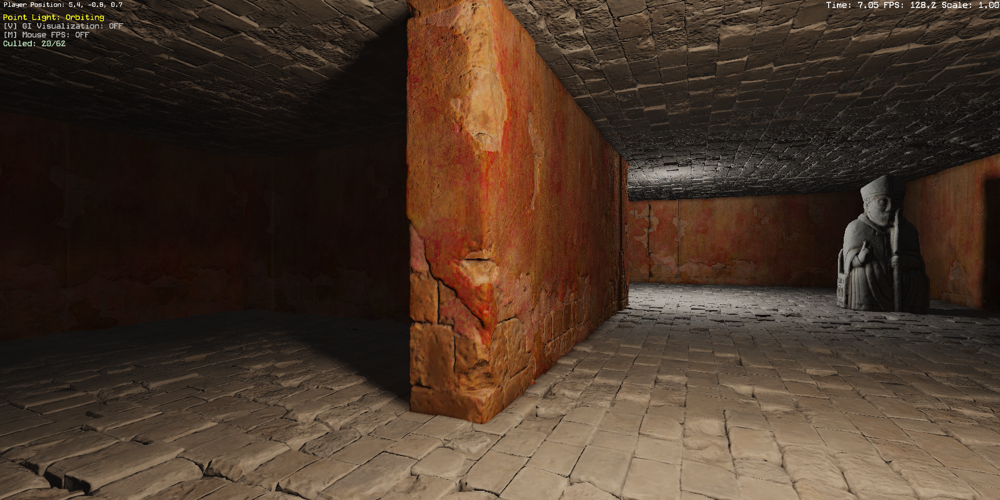
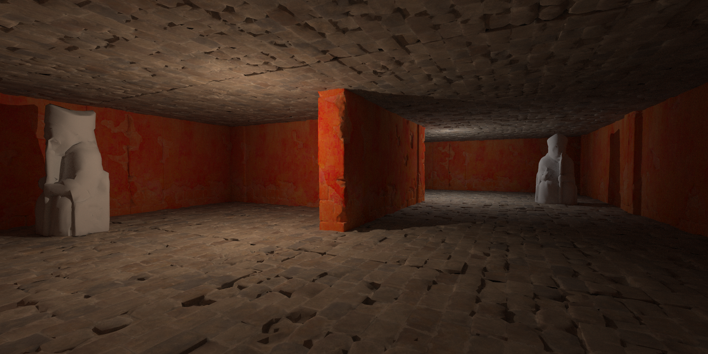
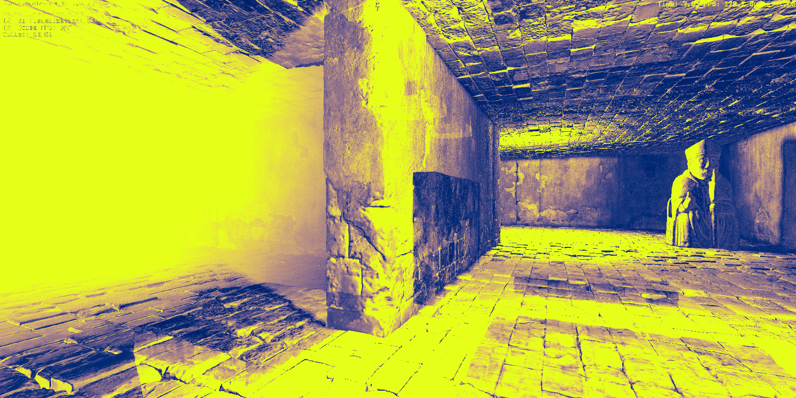

# LuminaGI-CudaRef

[English](README.md) | **简体中文**

> 中文版按面试讲述口径重写。技术术语保留英文，数字与英文版一致。

## 这是什么 / 为什么做

一个 CUDA path tracer，给我自己的 DX12 GI 引擎 [LuminaGI](https://github.com/CarlottaSeal) 当参考。LuminaGI 的 GI 是近似的（screen probe + voxel lighting + surface card cache）；这个 renderer 是 brute-force 的，所以它的输出能拿来 diff——给出 PSNR/SSIM 和一张逐像素 heatmap，看近似在哪里开始偏。

| LuminaGI（引擎） | CUDA reference（本 repo） | 绝对差 heatmap |
|---|---|---|
|  |  |  |

*测试场景：62 个 mesh、1.05M 三角形、3 个光源（1 sun + 2 point）。*

## Pipeline

```
LuminaGI (DX12)           │   LuminaGI-CudaRef (本 repo)
──────────────────────────┼────────────────────────────────────────
F9 ─┬─► screenshot.png    │
    └─► scene.json ───────┼──► LoadScene  ─► Build LBVH (150 ms)
                          │                      │
                          │                      ▼
                          │                  CUDA kernel (4 ms)
                          │                      │
                          │                      ▼
                          │                  reference.png
                          │                      │
        screenshot.png ───┼──► tools/diff.py ◄───┘
                          │          │
                          │          ▼
                          │     HTML report (PSNR / SSIM / heatmap)
```

引擎侧按 F9，`Scene::DumpToJSON()` 把世界空间的 triangle soup + 灯光 + 相机写进 `scene.json`、外加一张 screenshot；这边 `LoadScene` → 建 LBVH（150ms）→ CUDA kernel 出 `reference.png` → `tools/diff.py` 和 screenshot 对比出 HTML 报告。`validate.py` 一条龙跑完 render + diff。

## 数字

硬件：RTX 4080 Laptop, Ada Lovelace SM 8.9（58 SM, 12 GB, ~40 MB L2）。

| 阶段 | 时间 |
|---|--:|
| JSON load（1.05M tris, ~300 MB） | 12 s (host) |
| LBVH build（Morton + radix split） | 150 ms (CPU) |
| Render kernel, direct only, 1 spp | **4 ms** |
| Render kernel, 64 spp / 2 bounces | **3.0 s** |
| Render kernel, 256 spp / 2 bounces | **8.7 s** |
| Image diff（PSNR / SSIM / heatmap） | 1.5 s |

Reference vs engine（64 spp, 2 bounces）：PSNR **21.8 dB**、SSIM **0.631**、mean abs diff 13.4/255。

Nsight Compute（`accumulate_kernel`，完整分析见 [`docs/profile_analysis.md`](docs/profile_analysis.md)）：

| 指标 | 值 |
|---|--:|
| L2 Cache Throughput | **90.8%** |
| DRAM Throughput | 7.2% |
| L1 / L2 Hit Rate | 78.3% / 97.8% |
| Compute (SM) Throughput | 61.4% |
| Theoretical / Achieved occupancy | 66.7% / 61.8%（reg 修完后） |
| Branch Efficiency | 83.6% |

**最关键的一条结论：这个 kernel 是 L2-bandwidth bound、不是 compute-bound。** 工作集（~32MB BVH）基本装进 Ada 的 40MB L2，DRAM 几乎不碰（7.2%）。这一条决定了后面哪些优化有用、哪些没用。

和 LuminaGI 剩下的 PSNR 差距是**系统性的**：引擎有 ambient 项和 normal-map 细节这个 reference 没建模，它的 tonemap 也接近 sqrt gamma（试过 Reinhard+sRGB、更差）——所以 21.8dB 是"两个渲染器本来就不一样"，不是 bug。

## validation pipeline 抓到的两个隐藏 bug

1. `Scene::DumpToJSON` 把 mesh transform 重复应用了一次，因为 `MeshObject::GetWorldMatrix()` 已经含了它——mesh 全渲染在原点。PSNR 12.7 → 20.5 dB。
2. `DX12Renderer::CreateTextureFromImage` 没把源图路径拷到 `Texture` 上，GLB 内嵌 diffuse 贴图（棋子）dump 成空路径。补上名字 + 把 GLB 图导成 PNG：20.5 → 21.8 dB。

这两个都是 diff pipeline 自己抓出来的——也正是这个工具存在的价值。

## Neural denoiser（UNet on 8-spp output）

256-spp 一帧要 ~13s、大头是 Monte Carlo 噪声。训一个小 UNet 在（8-spp noisy, 256-spp clean）对上，把大部分差距补回来。

模型 = **4-level U-Net、32 base channel、~1.9M 参数**，预测 noisy 输入上的 **residual**（`out = clamp(input + UNet(input), 0, 1)`），**L1 loss**。数据 = **50 个相机 pose** 的（noisy, clean）对、**256×256 random crop**、**80 epoch**，留 **best val-L1 checkpoint**（长跑会后期发散）。baseline 是 Adam lr 1e-3；v3 recipe 升级成 **AdamW + cosine schedule + grad clip + weight EMA**，配 1024-spp clean target 再加 **+0.91 dB**（拆解：data +0.68 / optimizer +0.21 / EMA +0.02）。

| 变体 | 总时间 | PSNR vs GT | SSIM |
|---|--:|--:|--:|
| 8 spp raw | 400 ms | 34.52 dB | 0.815 |
| **8 spp + UNet** | **597 ms** | **42.04 dB** | **0.964** |
| 256 spp naive | 13,400 ms | 49.57 dB | 0.991 |

比 256-spp baseline 快约 **22×**，PSNR +7.5 dB（34.5 → 42.0）——补回约一半 PSNR gap、约 85% SSIM gap。

**诚实的 negative results**（都留在 docs 里，是这个项目的一个性质、不是遮丑）：VGG perceptual loss 三个权重都让两个指标都退（[`docs/perceptual_sweep.md`](docs/perceptual_sweep.md)）；G-buffer aux 输入（albedo + normal + worldpos，channel 集对齐 LuminaGI 的 deferred slot）在 50-pose 上退、在 150-pose/1024-spp 上退得**更多**——反而否掉了"pair 太少"这个假设（[`docs/v3_sweep.md`](docs/v3_sweep.md)）。

## Inference backends

PyTorch checkpoint 干净导出 ONNX（opset 17, dynamic N/H/W）。同一帧四个后端：

| 后端 | ms / 次 | vs PyTorch FP32 最大绝对差 | PNG PSNR | SSIM |
|---|--:|--:|--:|--:|
| PyTorch CUDA FP32 | 46.1 | 0 | 42.04 | 0.964 |
| ONNX Runtime CUDA EP FP32 | 56.3 | 0（bitwise） | 42.04 | 0.964 |
| ONNX Runtime CPU EP FP32 | 590.6 | 9.09e-06 | 42.04 | 0.964 |
| **TensorRT FP16** | **18.4** | 5.72e-04 | **42.04** | **0.964** |

TRT FP16 比 PyTorch CUDA 快约 **2.5×**、PNG 量化下看不出差别。

## Optimizations（测了才留 / 测了才砍——诚实招牌）

- **`__launch_bounds__(256, 4)`**：把 register 从 76 压到 64/thread，理论 occupancy 50%→75%（被 shmem 卡在 66.7%），实测约 5–10% 提速——留下。
- **Shmem BVH top-level cache（`-DBVH_USE_SHMEM`）**：BFS relayout 把树顶 255 个节点排前面、每个 block load 进 `__shared__`。A/B（64spp/2bounce，各 3 次）：**3336ms 关 vs 3343ms 开**——没差别，Ada 的 40MB L2 已经把这些节点常驻。留成可开关。（一个实现细节：取节点用**显式 if/else** 在 shared 和 global 之间选、不用三目——对两个不同地址空间的指针做三目会逼 nvcc 走 generic address space，代码注释里记着这会实测拖慢 load。）
- **Ray sort between bounces（`--sort`）**：ncu 的头号 lead——按方向 Morton 给 ray 排序、想降那 70% 的 uncoalesced 访问。A/B：**2950ms 关 vs 4410ms 开（慢 50%）**，输出一致（两边都 21.8dB）。同一个原因：L2 本来就 hold 住了重复流量，而排序反而加了 thrust + atomicAdd + kernel launch 开销。实现留在树里、behind flag。

这三条串起来是这个项目的招牌诚实故事：**ncu 说 L2-bound → launch_bounds 有用 → shmem cache 和 ray-sort 这两个"教科书该有用"的优化实测都没用/更慢**，因为瓶颈是已缓存数据上的**带宽**、不是延迟、也不是 coalescing。

## 引擎侧改动

`SD/Engine` 和 `SD/LuminaGI` 下四个文件：`Camera` 四个 getter（fov/aspect/near/far）；`Scene::DumpToJSON`（世界空间 triangle soup + 灯光 + 相机）；`App::RunFrame`（F9 置 pending 标志，capture 在 `EndFrame` **之后**跑）；`AutomatedTesting`（`--screenshot` 自动 dump 匹配的 `.json`）。

## Status

- [x] LuminaGI 侧 scene JSON dump（F9 或 `--screenshot`）
- [x] Host scene loader + LBVH（Morton + radix，150ms / 1.05M tris）
- [x] CUDA path tracer：primary ray、BVH traversal、shadow ray
- [x] Diffuse 贴图采样（CUDA texture object、sRGB decode、bilinear）
- [x] Indirect bounce：cosine-weighted hemisphere、Russian roulette、progressive accumulation
- [x] Image diff（PSNR/SSIM/heatmap）、HTML 报告、validate.py
- [x] Nsight Compute profile + SASS histogram
- [x] Ray sort between bounces（`--sort`，实测 +50% 慢，留成开关）
- [x] ONNX export（opset 17，ORT CUDA EP 与 PyTorch bitwise 一致）
- [x] TensorRT FP16 engine（2.5× 提速，PNG 输出一致）
- [x] Primary-hit G-buffer kernel（albedo/normal/worldpos；训了 12-ch UNet，指标回退——见 `docs/gbuffer_sweep.md`）
- [x] BVH 的 L2 persisting-cache window（`CUDAREF_L2_PIN=1`，opt-in 环境变量）
- [ ] 二进制 scene 格式（JSON parse 要 12s）
- [ ] Variance-aware adaptive sampling

构建 / 运行 / 完整文件结构见 [英文版 README](README.md)。
